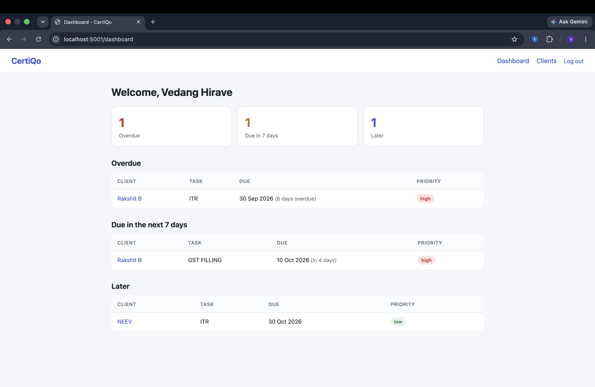
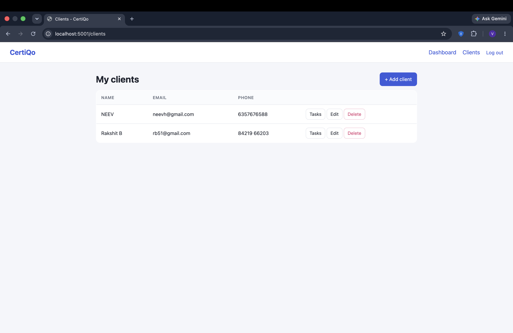
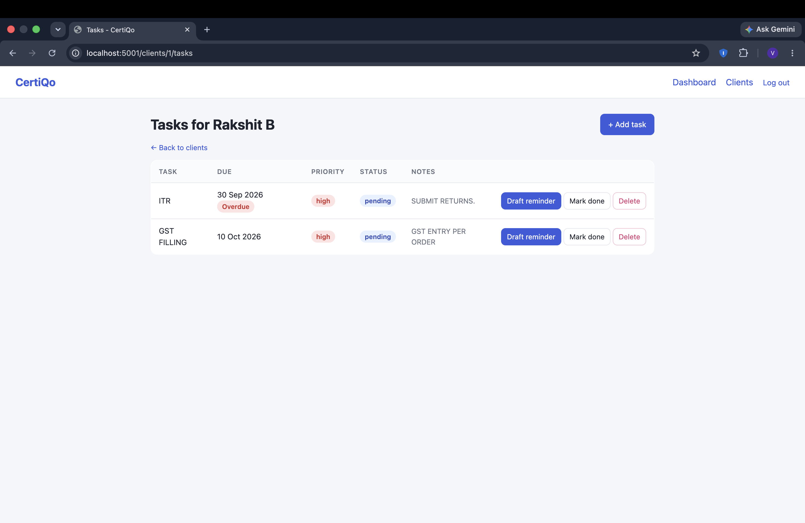
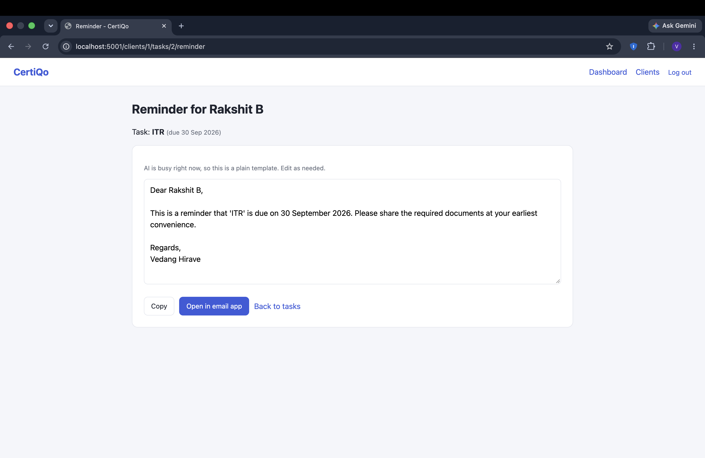
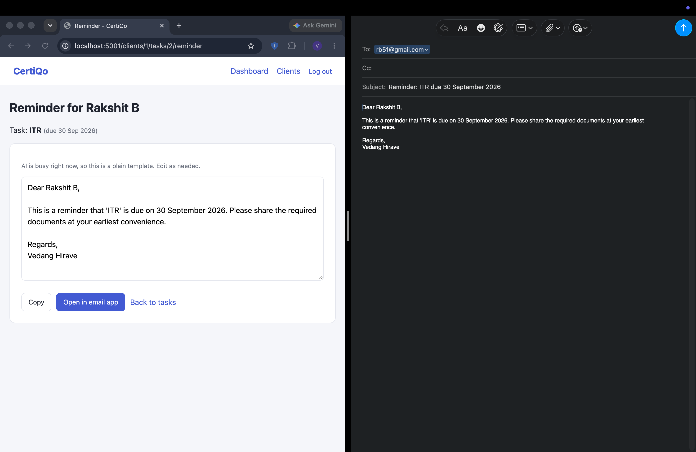

# CertiQo

A web app for Chartered Accountants to manage clients and track compliance deadlines, with AI-drafted reminder messages.

A CA adds clients, records compliance tasks (GST filing, ITR, and so on) with due dates and priorities, and sees at a glance what is overdue, due this week, or coming later. For any pending task, the app can draft a polite reminder to the client, which the CA reviews and edits before sending.

## Screenshots

| Dashboard | Clients |
|---|---|
|  |  |

| Tasks | AI-drafted reminder |
|---|---|
|  |  |

**Opens in the CA's own email app, ready to review and send:**



All names shown are fake demo data.

## Features

- Registration and login with hashed passwords and session-based authentication
- Per-user data isolation: every query is scoped to the logged-in CA, so one CA can never see or change another CA's clients or tasks
- Client management: add, list, edit, delete
- Compliance tasks per client with due date, priority, notes and done/pending status
- Urgency dashboard grouping pending tasks across all clients into overdue, due within 7 days, and later
- AI-drafted client reminders using the Gemini API, with a plain-template fallback if the AI service is busy or unavailable
- Reminder drafts can be edited, copied, or opened in the CA's own email app with the address and subject prefilled

## Design decisions

- **Human in the loop:** the AI never sends anything. The CA reads and edits every draft first, because a wrong date in a compliance message sent under a CA's name would be costly.
- **The AI does not decide deadlines.** Due dates come only from data the CA entered. The model is used only for wording, and the prompt tells it not to invent amounts, penalties or legal claims.
- **Graceful degradation:** AI calls retry on temporary server errors and fall back to a plain template, so the app works even when the AI service is down.
- **Provider isolation:** all AI calls go through one function in `ai.py`, so the model or provider can be swapped in one place.
- **Security basics:** parameterized SQL queries (no string-built SQL), POST for all state-changing actions, identical error message for wrong email or wrong password, secrets kept in `.env` and never committed.

## Tech stack

Python, Flask, MySQL, Jinja2 templates, HTML/CSS, Google Gemini API

## Project structure

```
app.py          Flask routes
db.py           database connection helper
ai.py           AI drafting with retry and fallback
schema.sql      database tables
templates/      HTML pages (shared layout in base.html)
static/         stylesheet
docs/           screenshots
```

## Database

Three tables: `users`, `clients` (each row belongs to a user), and `tasks` (each row belongs to a client). Ownership of a task is checked through its client.

## Setup

1. Create the database and a user in MySQL:

```sql
CREATE DATABASE certiqo;
CREATE USER 'certiqo_user'@'localhost' IDENTIFIED BY 'your_database_password';
GRANT ALL PRIVILEGES ON certiqo.* TO 'certiqo_user'@'localhost';
FLUSH PRIVILEGES;
```

2. Create the tables:

```bash
mysql -u certiqo_user -p certiqo < schema.sql
```

3. Create a virtual environment and install dependencies:

```bash
python3 -m venv venv
source venv/bin/activate
pip install -r requirements.txt
```

4. Copy `.env.example` to `.env` and fill in your values. Generate the secret key with:

```bash
python -c "import secrets; print(secrets.token_hex(32))"
```

5. Run the app:

```bash
python app.py
```

Then open http://localhost:5001 and register an account.

## Limitations and next steps

- Emails are not sent automatically; the CA sends them from their own email app
- No scheduled reminders yet (planned: a daily job that queues upcoming deadlines for the CA to approve)
- Not deployed yet
- Built as an MVP: no automated tests, no pagination
